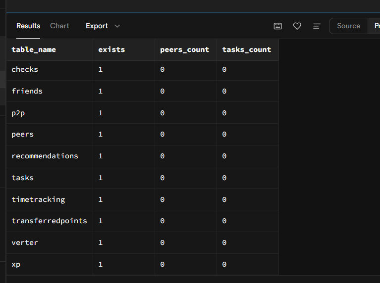
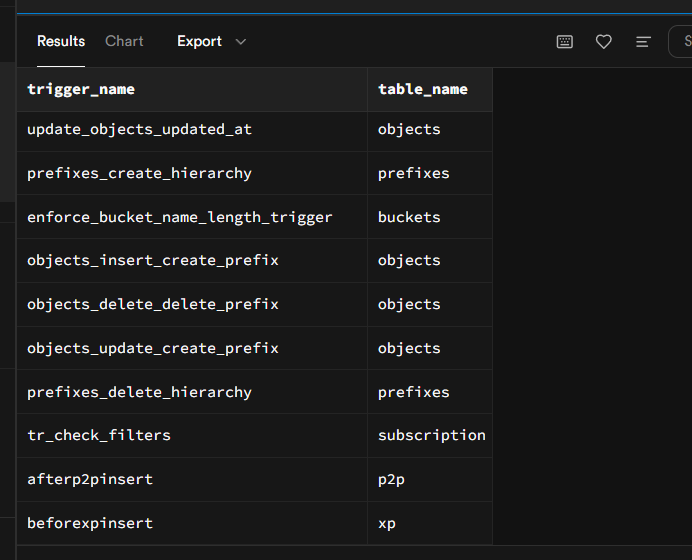

# 21laba  
## Тема: 1 task

---

##   таблицы для БД 

 Таблица 1: `Peers` — Информация о пирах
```sql
CREATE TABLE IF NOT EXISTS Peers (
    Nickname VARCHAR PRIMARY KEY,
    Birthday DATE NOT NULL
);
```

---

 Таблица 2: `Tasks` — Задания
```sql
CREATE TABLE IF NOT EXISTS Tasks (
    Title VARCHAR PRIMARY KEY,
    ParentTask VARCHAR REFERENCES Tasks(Title),
    MaxXP INTEGER NOT NULL
);
```

---

 Таблица 3: `checks` — Проверки заданий
```sql
CREATE TABLE IF NOT EXISTS Checks (
    ID BIGINT PRIMARY KEY GENERATED ALWAYS AS IDENTITY,
    Peer VARCHAR NOT NULL REFERENCES Peers(Nickname),
    Task VARCHAR NOT NULL REFERENCES Tasks(Title),
    Date DATE NOT NULL
);
```

---

 Таблица 4: `p2p` — P2P проверки
```sql
CREATE TABLE IF NOT EXISTS P2P (
    ID BIGINT PRIMARY KEY GENERATED ALWAYS AS IDENTITY,
    CheckID BIGINT NOT NULL REFERENCES Checks(ID),
    CheckingPeer VARCHAR NOT NULL REFERENCES Peers(Nickname),
    State check_status NOT NULL,
    Time TIME NOT NULL
);
```

---

 Таблица 5: `verter` — Проверки Verter'ом
```sql
CREATE TABLE IF NOT EXISTS Verter (
    ID BIGINT PRIMARY KEY GENERATED ALWAYS AS IDENTITY,
    CheckID BIGINT NOT NULL REFERENCES Checks(ID),
    State check_status NOT NULL,
    Time TIME NOT NULL
);
```

---

 Таблица 6: `transferredpoints` — Переданные пир-поинты
```sql
CREATE TABLE IF NOT EXISTS TransferredPoints (
    ID BIGINT PRIMARY KEY GENERATED ALWAYS AS IDENTITY,
    CheckingPeer VARCHAR NOT NULL REFERENCES Peers(Nickname),
    CheckedPeer VARCHAR NOT NULL REFERENCES Peers(Nickname),
    PointsAmount INTEGER NOT NULL
);
```

---

 Таблица 7: `friends ` — Дружеские связи
```sql
CREATE TABLE IF NOT EXISTS Friends (
    ID BIGINT PRIMARY KEY GENERATED ALWAYS AS IDENTITY,
    Peer1 VARCHAR NOT NULL REFERENCES Peers(Nickname),
    Peer2 VARCHAR NOT NULL REFERENCES Peers(Nickname),
    CHECK (Peer1 <> Peer2)
);
```

 Таблица 8: `recommendations ` — Рекомендации
```sql
CREATE TABLE IF NOT EXISTS Recommendations (
    ID BIGINT PRIMARY KEY GENERATED ALWAYS AS IDENTITY,
    Peer VARCHAR NOT NULL REFERENCES Peers(Nickname),
    RecommendedPeer VARCHAR NOT NULL REFERENCES Peers(Nickname),
    CHECK (Peer <> RecommendedPeer)
);
```

---

 Таблица 9: `xp` — Опыт
```sql
CREATE TABLE IF NOT EXISTS XP (
    ID BIGINT PRIMARY KEY GENERATED ALWAYS AS IDENTITY,
    CheckID BIGINT NOT NULL REFERENCES Checks(ID),
    XPAmount INTEGER NOT NULL
);
```

---

 Таблица 10: `timetracking ` —Отслеживание времени в кампусе
```sql
CREATE TABLE IF NOT EXISTS TimeTracking (
    ID BIGINT PRIMARY KEY GENERATED ALWAYS AS IDENTITY,
    Peer VARCHAR NOT NULL REFERENCES Peers(Nickname),
    Date DATE NOT NULL,
    Time TIME NOT NULL,
    State INTEGER NOT NULL CHECK (State IN (1, 2)) -- 1 = вход, 2 = выход
);
```

---




---
## Тема: 1 и 2 task

## 3. 1. Процедура добавления P2P проверки

```sql
CREATE OR REPLACE PROCEDURE AddP2PCheck(
    IN CheckingPeer VARCHAR,
    IN CheckedPeer VARCHAR,
    IN TaskName VARCHAR,
    IN CheckState check_status,
    IN CheckTime TIME
) AS $$
DECLARE
    CheckID BIGINT;
BEGIN
    -- Вставляем запись в Checks, если её ещё нет
    INSERT INTO Checks (Peer, Task, Date)
    VALUES (CheckedPeer, TaskName, CURRENT_DATE)
    ON CONFLICT DO NOTHING
    RETURNING ID INTO CheckID;

    -- Если запись уже есть, получаем её ID
    IF CheckID IS NULL THEN
        SELECT ID INTO CheckID
        FROM Checks
        WHERE Peer = CheckedPeer AND Task = TaskName AND Date = CURRENT_DATE;
    END IF;

    -- Вставляем запись в P2P
    INSERT INTO P2P (CheckID, CheckingPeer, State, Time)
    VALUES (CheckID, CheckingPeer, CheckState, CheckTime);
END;
$$ LANGUAGE plpgsql;
```

---
## 2. Процедура добавления проверки Verter'ом
```sql
CREATE OR REPLACE PROCEDURE AddVerterCheck(
    IN CheckedPeer VARCHAR,
    IN TaskName VARCHAR,
    IN CheckState check_status,
    IN CheckTime TIME
) AS $$
DECLARE
    CheckID BIGINT;
BEGIN
    -- Находим ID последней проверки для этого пира и задания
    SELECT c.ID INTO CheckID
    FROM Checks c
    WHERE c.Peer = CheckedPeer AND c.Task = TaskName
    ORDER BY c.Date DESC, c.ID DESC
    LIMIT 1;

    -- Вставляем запись в Verter
    INSERT INTO Verter (CheckID, State, Time)
    VALUES (CheckID, CheckState, CheckTime);
END;
$$ LANGUAGE plpgsql;

```

## 3. Триггер для автоматического обновления TransferredPoints
```sql
CREATE OR REPLACE FUNCTION UpdateTransferredPoints()
RETURNS TRIGGER AS $$
BEGIN
    IF NEW.State = 'Start' THEN
        INSERT INTO TransferredPoints (CheckingPeer, CheckedPeer, PointsAmount)
        VALUES (
            NEW.CheckingPeer,
            (SELECT Peer FROM Checks WHERE ID = NEW.CheckID),
            1
        )
        ON CONFLICT (CheckingPeer, CheckedPeer)
        DO UPDATE SET PointsAmount = TransferredPoints.PointsAmount + 1;
    END IF;
    RETURN NEW;
END;
$$ LANGUAGE plpgsql;

```

код создания тригера 
```sql
DROP TRIGGER IF EXISTS AfterP2PInsert ON P2P;
CREATE TRIGGER AfterP2PInsert
AFTER INSERT ON P2P
FOR EACH ROW
EXECUTE FUNCTION UpdateTransferredPoints();
```

